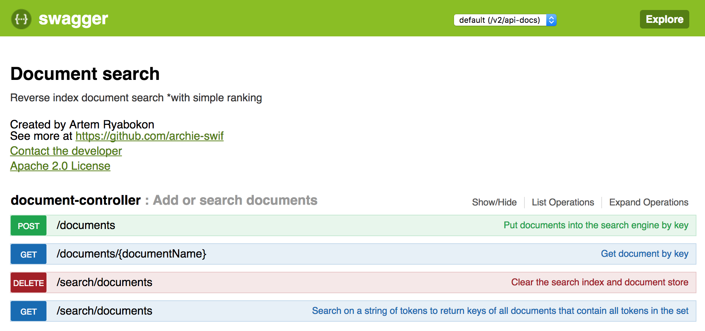
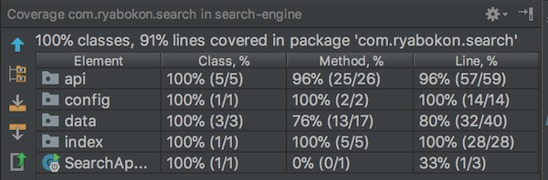

# search-engine

Reverse index document search with simple ranking*

## Main features

1. Put documents into the search engine by key.
2. Get document by key.
3. Search by a string of tokens and return keys of all documents that contain __all__ tokens in the set.
4. \*Search results **ranking** is done based on word frequency in documents.
5. \*Clean up data for test purposes


## Installation and running

Runnable jar can be downloaded from the [release page](https://github.com/archie-swif/search-engine/releases)

And launched from the command-line

```java -jar search-engine-0.0.1.jar```

---

Also, search-engine can be launched from Idea IDE or with maven:

```mvn spring-boot:run```

## Usage

Navigate to http://localhost:8080 to open a swagger page

Four rest APIs are available to test the search-engine app



## Tests

Unit and integration tests are available in the test directory.
Test coverage is **91% Lines**



## Spent time

* 3 hours to implement and test a primitive reverse index search
* 2 hours to refactor and prettify the code for better modularity
* 2 hours to add Spring Boot and implement REST API
* 3 hours for integration and unit tests

#### Total: **10 hours**

